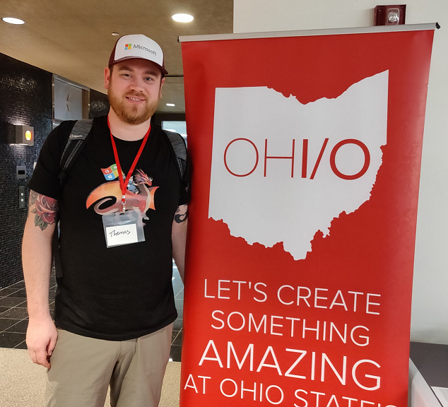
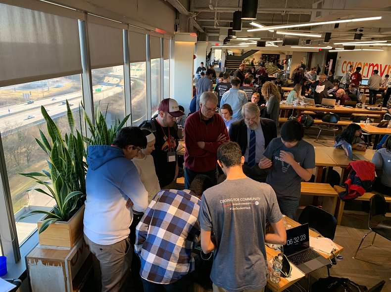

Whoa, it's been a while since I got a post out. Between my slower posting schedule and the fact that I moved from WordPress to GitHub pages (and changed the domain), it's a miracle I have any SEO points left at all! Anyway, that's not really the point of this post. The point of this post is to talk about the cool event I attended recently in Columbus, Ohio. **Spoiler alert**: I was blown away.

> If you like (or don't like) the story time format blog posts, please let me know my tweeting me: [@MrThomasRayner](https://twitter.com/MrThomasRayner). A lot of what I work on during my day job is stuff I don't feel comfortable blogging about, and since that used to be my main source of blog post ideas, the story format might help get me writing again.

## About the event

[Hack OHI/O](https://hack.osu.edu/) is a program which is self-described as fostering a tech culture at Ohio State University and the communities nearby. They've been around since 2013 and run a bunch of events. One of the people in my management chain is an OSU grad and worked to coordinate some sponsorship money from Microsoft in support of this awesome program, and that's how I ended up getting to attend High School I/O event to provide some mentorship to the students participating and judging the projects at the end of the day.

The High School I/O event I went to, as the name suggests, is for high school aged kids. A lot of the other mentors were actually OSU Comp Sci students who volunteered their time. There were also folks there from Cover My Meds, who hosted us, and a handful of other local organizations. I think I won the "traveled the furthest to be here" award, having flown from the Seattle area. So, let me tell you the story of my weekend.

## Friday

I made my way to SeaTac on Friday morning to head out to Columbus. The only direct flight had a 9:45 AM departure, so no sleeping in for me! I actually ended up waking up at the same time I'd wake up any other day. I recorded all the demos for my Writing Compiled PowerShell Cmdlets session for the PowerShell & DevOps Global Summit on the 4 hour flight there. When I landed, I finally got to meet [@StevieCoaster](https://twitter.com/steviecoaster) who generously picked me up from the airport. We inadvertently attended three different breweries and taphouses (one closed for an event, one super full, and one that got us in). We sampled their wares, had dinner, exchanged stickers and swag, and gossiped relentlessly about the PowerShell community. It was awesome to meet Stevie, and I can't wait to see him and a bunch of other folks again at PshSummit in April.

## Saturday

Saturday was the day of the hackathon, and it was a _full_ day. With the time difference, it felt like a 3:30 AM wake up to start things off. That's nothing a little caffeine and enthusiasm can't fix, so I got my act together and headed over to the event. I was a little early and stashed myself away in a conference room while the organizers and hosts finished setting up. I'm not sure why I thought it might start on time 😄. I chatted with some of the hosts who were Cover My Meds employees, and some of the other organizers and mentors who were mostly OSU Comp Sci students.

### Mentoring the mentors

A lot of the students have internships lined up this summer for companies in the Seattle area, and were both excited and nervous about being that far from their homes in Ohio. As someone who just moved from his hometown to the Seattle area last year, I had a lot of empathy for them, but luckily, I could attest to how much I love being in Washington, and gave them some encouragement about that aspect of their internships. A couple of the students commented that they were going to miss college, where they had a stable group of friends, in familiar surroundings. They were excited for the next steps in their journey, but some had a gut feeling that they might not stay in touch in the long term, which I think is totally normal. Having gone through college and worked for a few different employers, I can definitely confirm that the folks you see every day at school or work aren't always the people you end up forming long term relationships with after one of you leaves for something new. There are some that do, though, and I think those are true life-long friends. In my opinion, you're lucky to have more than a few of those.

### So, how about the hackathon itself?

The high schoolers who came had a huge array of ideas. There were IoT, mobile, web, desktop, and lots of other projects going on. There were games, self-help websites, social networks, accessibility tools, and tons more. This event didn't have a particular theme (like an upcoming Hack OHI/O event for college aged students that focuses on AI, and others), so the students were pretty much left to their own devices. I had prepared a few suggestions for projects for groups that didn't know what to do, but nobody I talked to had any trouble thinking of something to work on. The diversity among attendees was just as great to see. Students came from all kinds of different socioeconomic and ethnic backgrounds, as well as different genders. The value of the unique perspectives that come from having a team of diverse individuals is something that I've known for a long time, and something that Microsoft (my employer) very strongly believes in. I didn't know what to expect at this event, but was refreshed and excited to know that programs like Hack OHI/O are reaching such a wide group of people.

#### Hacking for good

The humanitarian focus of a majority of projects was something I didn't expect. I figured I'd see a lot of games and mobile apps. While I _did_ see a lot of games and mobile apps, they were largely gamifying different aspects of self-help. Here's a brief (absolutely not complete) list of projects I talked to students about:

* An IoT boat-drone that carries healthy plants around ponds and lakes to help clean up pollution
* A mobile app that surveys biometric and environmental area, correlated with a survey about your emotional state to help you identify what kind of places you find least stressful
* A site dedicated to helping people with PTSD avoid their triggers via crowd sourcing
* A mobile app that encourages kids with braces to wear their elastic bands by having them take a selfie with their bands on, and if their bands _are_ on, awarding them points that go towards gift cards
* An IoT deadbolt that opens if it can identify the person by their knock
* A mobile app that helps hackathon attendees find events and projects to work on, as well as people with complimentary skillsets
* A site that helps people get the right amount of sleep
* A site that helps people with hearing problems properly adjust their volume and EQ settings
* A tool to help avoid "too much screen time" related headaches

That's just a small list of what I can remember off the top of my head. There were a bunch more groups who were all working on equally awesome projects. I was blown away to see high school aged people focused on using technology for good so early in their tech adventures. I'm an enormous believer in using tech to help people, and it was amazing to see the bright, creative minds of tomorrow focused on making that tomorrow better not just for themselves, but for each other.

### These kids weren't messing around

You might wonder how much a team of 2 - 4 high school students could deliver in 8 hours of hacking time, like I was. To be certain, nothing that came out of this hackathon is ready for VC funding, but that's not really the point, eh? Between the group of girls who "learned Unity in a day", to the group of kids who "discovered how easy it is to get started with Firebase", and the group who "was surprised how inexpensive it could be to get 4 Raspberry Pis on Amazon", it immediately became clear that these youngsters who've grown up immersed in technology have no fear about diving into something new and quickly learning it. That kind of curiosity and thirst for learning is obviously going to be a huge advantage as these people grow up and enter the work force. For real, watch out for Gen Z.

I saw groups building client/server apps in Java, writing Swift, all kinds of JavaScript - including Typescript, C#, C++, C, Python, Rust, and more that I'm just not remembering right now. Sure, there was some maturity missing from the dev process (poorly handled secrets everywhere, not a lot of CI/CD), but to expect enterprise dev level maturity from kids who haven't finished high school yet is obviously ridiculous. That kind of thing comes later.

I asked some of the groups how similar their projects were to other things they've worked on outside of this hackathon and was floored at the different apps, sites, tools, and games I was immediately shown. Their passion is contagious, and it was a huge privilege to get to chat with them about life, technology, and Microsoft all day.

Eventually, we crowned some winners:

* Best Designed Hack: A group of ladies who "learned Unity in a day" to make a game with a humanitarian focus
* Best Unfinished Idea: A group of guys who made that IoT deadbolt that recognized knocks of different individuals
* Most Original Hack: A group who made a site that helps people self-diagnose minor illnesses and remedy them at home
* Greatest Social Impact: These guys made an app that models your stress/happiness level based off environmental data
* Most Technically Difficult: The group who made a mobile app that connected hackathon attendees with hackathons and ideas for projects

The winners and runners up got their prizes (some gift cards and cool tiny Microsoft Azure branded bluetooth speakers), and everyone said their goodbyes and made their way home. I headed back to my hotel to crash after a huge 14 hour day of fun.

## Sunday

After a much needed sleeping in, I got myself together, checked out of my hotel, and found my way to the airport. There's not much to report about Sunday, other than I'm currently writing, and am about to publish this post from the plane on my way home while the experience is fresh, and I can't wait to be back in Redmond! It was fun visiting Columbus, but man is it always great to come home to the PNW 😁.

## Closing thoughts

It was so cool to get to attend this event and connect with the students who were participating (and mentoring). It was refreshing and invigorating to witness their enthusiasm and passion, as well as their focus on contributing positively to their community. I'll certainly be doing my best to bring that energy back to Redmond and my work at Microsoft.

Thank you to Hack OHI/O for having me, and to Microsoft for sponsoring the event and sending me. I hope my teammates who attend their next few events have an experience that is rewarding as mine was.