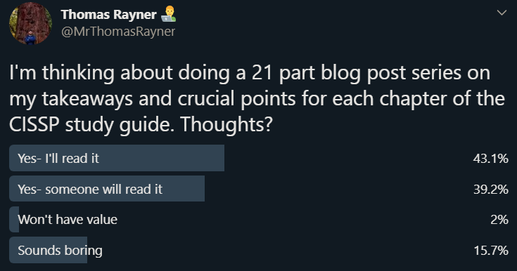

Last summer I spent about a month studying for and getting my Certified Information Systems Security Professional (CISSP) certification from ISC2. I went about studying for the test a few ways:

* I used the PocketPrep app - check your phone's app store. I paid for it ($40 at the time) and did all of the questions. I found it was a great way to study in smaller durations of free time.
* I attended a study bootcamp - my employer had a bunch of us going through the process of studying for the CISSP exam at the same time, and hired a professional to put us through a week long bootcamp. I found it super helpful to get "insider" tips on how the exam is constructed, and to hear tales of the test from someone who has written and passed it many times.
* I did a bunch of practice tests - these came with my book.

And finally...

* I got the ISC2 CISSP official study guide - I read it cover to cover, and highlighted and annotated the entire thing.

I took to Twitter ([@MrThomasRayner](https://twitter.com/mrthomasrayner)) to find out if there was interest in a series about my takeaways and crucial points from each chapter in the ISC2 CISSP official study guide, and found that there was.

So, here we go! Welcome to my 21 part series on the takeaways and crucial points from each chapter in the ISC2 CISSP official study guide. To be clear, this isn't a replacement for all those other study methods I mentioned above. This is just a supplement. This also isn't *everything* you need to know for the test. This is just what I feel are the most important points.

> It's important to remember that while many of these terms and phrases have different meanings in different contexts, the definitions I'm providing below are the ones that are relevant in the CISSP exam. Your own training or experience may tell you that a definition is incorrect or invalid, but if you want to get the exam questions right, you'll have to know them as they're defined in the books and study material.

The CISSP exam is often said to be "a mile wide but only an inch deep" which means you need to know a little bit about **a lot of stuff**. Accordingly, these posts contain **a lot of points** and while you might not be questioned on all of them, you could be questioned on any of them. It's important to have a good grip on *every chapter* in its entirety.

## Chapter 1: Security Governance Through Principles and Policies

### What this chapter is about

This chapter introduces security governance, management concepts, and principles which are inherent elements in security policy and in solution deployment. It covers a swath of foundational information that serves many of the other chapters in the book, like the CIA Triad and data classification.

Later, Chapter 1 discusses threat modeling, after it covers security control frameworks.

### My key takeaways and crucial points

#### The CIA Triad

* The most important security principle is the CIA triad. It stands for "Confidentiality", "Integrity", and "Availability".
* Confidentiality
  * The secrecy of data, objects or resources.
  * Encryption is a popular control for managing confidentiality.
  * An object is a "passive element" - files, computers, network connections, applications.
  * A subject is an "active element" - users, programs, computers (yes computers can be both active and passive depending on context).
* Confidentiality terms:
  * *Sensitivity* - The attribute of information that could cause harm or damage if it was disclosed.
  * *Discretion* - Where one can influence or control data.
  * *Criticality* - The level to which data is "mission critical".
  * *Concealment* - The act of hiding data to prevent disclosure. Sometimes this means "security through obscurity".
  * *Privacy* - The confidentially of data that is *personally identifiable* or that might cause harm, embarrassment, or disgrace to someone if revealed.
  * *Seclusion* - Storing something in an out-of-the-way location.
  * *Isolation* - Keeping something separate from others.
* Integrity
  * The veracity/accuracy of data.
  * Assurance that data can be intentionally modified only by authorized subjects.
  * Cryptographic signing is a popular control for managing integrity.
  * Integrity means:
    * Preventing unauthorized subjects from making modifications.
    * Preventing authorized subjects from making unauthorized modifications, even mistakes.
    * Maintaining consistency of data so that they are true and correct.
  * Integrity depends on confidentiality.
* Integrity terms:
  * *Accuracy* - Being correct and precise.
  * *Truthfulness* - Being a true reflection of reality.
  * *Authenticity* - Being authentic or genuine.
  * *Validity* - Being factually or logically sound.
  * *Nonrepudiation* - Not being able to deny having performed an activity, being able to verify the origin of something.
  * *Accountability* - Being responsible for actions and results.
  * *Responsibility* - Being in charge or having control over something.
  * *Completeness* - Having all needed parts.
  * *Comprehensiveness* - Being complete in scope.
* Availability
  * The timely and uninterrupted access to objects.
  * Denial of service attacks are attacks on availability.
* Availability terms:
  * *Usability* - The state of being easy to use or learn or being able to be understood and controlled.
  * *Accessibility* - Assurance that the widest range of subjects can interact with a resource regardless of their capabilities.
  * *Timeliness* - Being prompt, on time, or within a reasonable timeframe.

#### Other Security Concepts

* AAA services provide "Authentication", "Authorization", and "Accounting" (aka "Auditing").
* *Identification* - Claiming to be an identity.
* *Authentication* - Proving that you are that identity you claim.
* *Authorization* - Defining permissions of a resource and object access for a specific identity.
* *Auditing* - Recording a log of events and activities. Can be used to detect unauthorized activity or abuse.
* *Accounting* - Reviewing log files to check for compliance. Linking a human to the activities of an electronic identity.
* "Monitoring" is a type of watching or oversight, while "auditing" is a recording of information to a record or file.
* *Layering* - aka "Defense in Depth". The use of multiple controls in a series.
  * Performing security restrictions in series means they are performed one after another in a linear way.
* *Abstraction* - Similar elements are put into groups or roles that are assigned security controls as a collective.
  * Classifying objects.
* *Data hiding* - Preventing data from being discovered or accessed by a subject by positioning the data in a logical storage compartment that is not accessible or seen by the subject.
  * "Security through obscurity" is different. Data hiding is intentionally positioning data out of view, while security through obscurity is not informing a subject about an object being present.
* *Encryption* - Hiding the meaning or intent of a communication from unintended recipients.

#### Evaluate and Apply Security Governance Principles

* *Security governance* - Supporting, defining, and directing the security efforts of an organization.
  * NIST 800-53 or 800-100 standards apply here.
* Governance is responsible for *security policies*
* *Business case* - A documented argument or stated position. Helps to make a decision or take some action by demonstrating a business-specific need.
* *Top-down approach* - One of the most effective ways to tackle security management planning.
  * Upper management is responsible for initiating and defining policies.
  * Middle management is responsible for fleshing out policies into standards, baselines, guidelines and procedures.
  * Operational management then must implement the configurations as prescribed.
  * End users must comply with security policies.
  * Opposed by the *bottom-up* approach where IT staff make security decisions without input from senior management.
* Security management being the responsibility of upper management illustrates that it is an issue of business operations rather than IT administration.
* Any and all security management plans fail without senior management approval and commitment to the security policies.
* Types of plans:
  * *Strategic plan* - Executives are responsible. A long-term plan that is fairly stable. It should include a risk assessment.
  * *Tactical plan* - Managers are responsible. Midterm plan developed to provide more details on accomplishing the strategic plan's goals. Includes and schedules the tasks necessary to accomplish organizational goals.
  * *Operational plan* - Employees are responsible. Short-term, highly detailed plan based on strategic and tactical plans. Define how to accomplish the various goals of the organization. Includes resource allotments, budgets, staff assignments, schedules, and step-by-step procedures.
* Security governance is a continuous process.
* *Change control/management* - Ensure that any change does not lead to reduced or compromised security, and the possibility to roll back any change to a previously secured state.
  * Change management is crucial for maintaining security by managing change systemically.

#### Data Classification

* *Data classification* - The primary means by which data is protected is based on its need for secrecy, sensitivity or confidentiality.
  * This is the process of organizing items, objects, subjects, etc. into groups and categories with similarities.
  * Securing all data at the same level is inefficient. Securing everything at a low level means sensitive data is exposed. Securing everything at a high level is too expensive and restricts access to some data unnecessarily.
* *Declassification* - Once an asset no longer warrants or needs the protection of its assigned level, it needs to be declassified.
* Government/military classification
  * *Top secret* - Highest level. Unauthorized disclosure will have drastic effects and cause grave damage. It's compartmentalized on a *need-to-know* basis. A user could have top-secret clearance and have no access to data until they need to know about it.
  * *Secret* - Unauthorized disclosure has significant effects and cause critical damage.
  * *Confidential* - Unauthorized disclosure has noticeable effects and cause serious damage.
  * *Sensitive but Unclassified* - Used for data that is for office use only. Unauthorized disclosure could violate the privacy rights of individuals.
  * *Unclassified* - Data that is neither sensitive nor classified.
  * Top secret, secret, and confidential are "classified" categories. Sensitive but Unclassified, and Unclassified are "not classified" categories.
* Commercial business/private sector classification
  * *Confidential* - Highest level of classification. Proprietary data, disclosure has drastic effects on **competitive edge** of an organization.
  * *Private* - Private or personal nature, intended for internal use only.
  * *Sensitive* - More classified than public data. A negative impact would occur if disclosed.
  * *Public* - Lowest level of classification. Used for all data that does not fit a higher classification.
* *Ownership* - The formal assignment of responsibility to an individual or group. Owners often have full capabilities and privileges over the objects they own.

#### Organizational Roles and Responsibilities

There is a lot to know about each of these roles. Here are the key points about each one.

* *Senior manager* - Organization owner. Must sign off on all policy issues.
* *Security professional* - A trained and experienced engineer who is responsible for following the directives of management.
* *Data owner* - Responsible for classifying information so it may be placed and protected within the security solution.
* *Data custodian* - Implements the prescribed solution. Perform all activities needed to provide protection.
* *User* - A person who has access to a secured system. Responsible for understanding and upholding the security policy.
* *Auditor* - Reviews and verifies that the security policy is properly implemented and adequate.

#### Security Control Frameworks

* Security control frameworks are standards that help plan an overall security solution.
* *COBIT* - Control Objectives for Information and Related Technology.
  * 5 key principles:
    1. Meeting stakeholder needs
    1. Covering the enterprise end-to-end
    1. Applying a single, integrated framework
    1. Enabling a holistic approach
    1. Separating governance from management
  * Crafted by the Information Systems Audit and Control Association (ISACA).
* ISO/IEC 27002, ITIL are other standards to know about.

#### Due Care and Due Diligence

* *Due care* - Means "correction". Using reasonable care to protect interests of an organization.
* *Due diligence* - Means "detection". Practicing the activities that maintain the due care effort.
* Showing both due care and due diligence are the only ways to disprove negligence in an occurrence of loss.

#### Developing Documents

* Security Policies
  * Defines the scope of security needed.
  * Discusses the assets that need security and the extent that security solutions should go to provide the protection.
  * Defines all relevant terms.
* *Acceptable Use Policy* - Designed to assign security roles within the organization as well as ensure the responsibilities tied to those roles.
* *Standard* - Defines compulsory requirements.
* *Baseline* - Minimum level of security. Operationally focused.
* *Guideline* - Offers recommendations.
* Security Procedures
  * Step-by-step how-to documentation.
  * Not all users need to know all parts of every standard, baseline, guideline and procedure.
  * Avoid creating one giant monolithic document.

#### Threat Modeling

* The process where potential threats are identified, categorized and analyzed.
* Not a single event.
* Proactive approach takes place during development. AKA a defensive approach.
* Reactive approach takes place after a product has been created and deployed.
* Identifying threats - methods:
  * The focus in threat modeling is on **objects**
  * *Focused on assets* - Uses asset valuation results and tries to identify valuable assets.
  * *Focused on attackers* - Try to identify potential attackers and identify their goals.
  * *Focused on software* - Considering threats against in-house developed software.
* STRIDE is a scheme developed by Microsoft for threat categorization.
  * *Spoofing* - Using a falsified identity.
  * *Tampering* - Unauthorized changes.
  * *Repudiation* - Plausible deniability.
  * *Information disclosure* - Distribution of information to external or unauthorized entities.
  * *Denial of service (DoS)* - Prevents authorized use of a resource.
  * *Elevation* - A limited user account is used to gain greater access.
* Process for Attack Simulation and Threat Analysis (PASTA) is another methodology.
  1. Definition of the objectives (DO) for analysis of risks
  1. Definition of the technical scope (DTS)
  1. Application decomposition and analysis (ADA)
  1. Threat analysis (TA)
  1. Weakness and vulnerability analysis (WVA)
  1. Attack modeling and simulation (AMS)
  1. Risk analysis and management (RAM)
* TRIKE is another methodology that focuses on a risk-based approach.
* Disaster, Reproducibility, Exploitability, Affected Users, and Discoverability (DREAD) is another methodology.
* Visual, Agile, and Simple Threat (VAST) based on Agile project management and programming principles.
* *Reduction analysis* - Decomposing the application, system or environment into smaller containers or compartments. The purpose is to gain a greater understanding of the product and its interactions with other elements.
  * *Trust boundaries* - Any location where the level of trust or security changes.
  * *Data flow paths* - The movement of data between locations.
  * *Input points* - Locations where external input is received.
  * *Privileged operations* - Any activity that needs greater than standard privileges.
  * *Details about security stance and approach* - The declaration of policy, foundation and assumptions.

#### Prioritization and Response

* Define the means, target, and consequences of a threat.
* Rank threats using a *probability* x *damage potential* calculation.
* Rankings can be subjective and arbitrary sometimes, but should at least be consistent.
* Use a "high/medium/low" scale for each element of the calculation for simplicity if you must.
* High-priority items need to be addressed immediately.
* DREAD provides a rating system designed to be flexible:
  * *Damage potential* - How severe is the damage likely to be?
  * *Reproducibility* - How complicated is it for attackers to reproduce the exploit?
  * *Exploitability* - How hard is it to perform the attack?
  * *Affected users* - How many users are going to be affected (as a percentage)?
  * *Discoverability* - How hard is it for an attacker to discover this weakness?

#### Apply Risk-Based Management Concepts to the Supply Chain

* *Secure supply chain* - Where all vendors and links are reliable, trustworthy, reputable organizations.
* All links disclose their practices and security requirements to their business partners, but not necessarily to the public.
